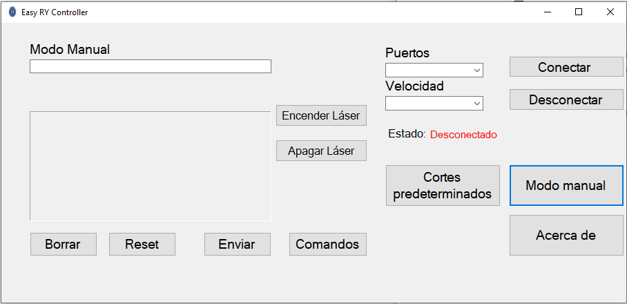

# CNC_controller 
Programa para control de máquina CNC con ejes cilindricos, con una interfaz un poco más amigable a lo convencional.

## Objetivo del proyecto 
Brindar una interfaz amigable a lo normal para que pueda ser usada facilmente por los operarios.

## Autores 
  1. [Williams Bobadilla](https://github.com/WilliBobadilla)
  2. [Guillermo Ruiz](https://github.com/gbruiz)
  3. Enrique Benitez 
  
## Requerimientos
1. .Net Framework, normalmente en las maquinas con SO Windows no necesitan ninguna instalacion externa

## Puesta en marcha :rocket:
[Ejecutable para Windows](https://github.com/WilliBobadilla/CNC_controller/blob/master/CNC_controler/CNC_controler/bin/Debug/CNC_controler.exe)

## Screenshoots :iphone:

 
  

# Licencia 
[MIT License](https://opensource.org/licenses/MIT)

